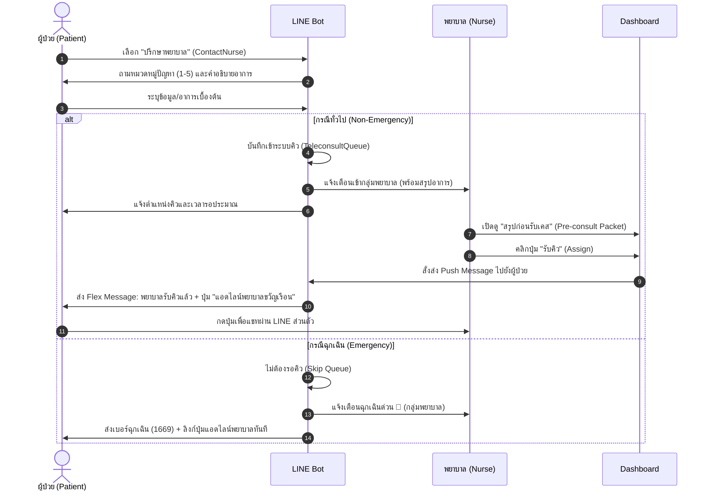

# Design Spec: Teleconsult Hybrid Workflow & Knowledge Base Polish

This document details the design specifications for:
1. Enhancing the "ปรึกษาพยาบาล" (Teleconsultation) flow to integrate a direct chat link for Nurse Kwanruean (`https://line.me/ti/p/0899181839`) while maintaining the existing triage and queue dashboard features.
2. Standardizing and polishing the "ความรู้และคำแนะนำ" (Knowledge Base) texts to resolve formatting clutter and line overflow/wrapping on mobile screens.

---

## 1. Teleconsultation Hybrid Workflow (Option C)

### Goal
Allow patients to easily add Nurse Kwanruean via LINE to chat directly, without flooding the nurse with random out-of-hours messages or bypassing the queue triage system which collects key patient parameters.

### Flow Details



### Components

#### A. LINE Contact Settings
Configure the nurse contact link in `config.py` via environment variable with a fallback default:
* Env key: `NURSE_CONTACT_LINK`
* Default value: `https://line.me/ti/p/0899181839`

#### B. Dashboard Acceptance Trigger (`services/dashboard_actions.py`)
In `assign_nurse_to_session`, after updating the status to `in_progress`, trigger a LINE push notification to the patient:
* Message type: **Flex Message** (when `ENABLE_RICH_MESSAGES` is True) or plain text fallback.
* Content:
  - Header: `💚 พยาบาลรับคำขอของคุณแล้ว`
  - Body: `พยาบาลขวัญเรือนยินดีให้บริการค่ะ คุณสามารถกดปุ่มด้านล่างเพื่อแอดไลน์พยาบาลและเริ่มพูดคุยปรึกษาได้ทันทีค่ะ`
  - Button CTA: `💬 แอดไลน์คุยกับพยาบาล` (URL: `https://line.me/ti/p/0899181839`)

#### C. Emergency Fast-Path Response (`services/teleconsult.py`)
In `handle_emergency`, append a quick CTA button or link in the response:
* Plain text fallback: `"หากสะดวกติดต่อผ่านไลน์เพิ่มเติม สามารถแอดไลน์พยาบาลขวัญเรือนได้ที่นี่ค่ะ: https://line.me/ti/p/0899181839"`
* Flex Message (if enabled) with a direct button.

---

## 2. Knowledge Base Formatting Polish

### Goal
Resolve text overflow, wrapping, and messy indentation of sub-items on small mobile screens.

### Design Principles
1. **Remove Wide Double-Lines**: Replace `═══════════════════════════` or `___________________` with a safe 15-character line like `───────────────` or use whitespace/headers instead of line separators.
2. **Standardize Bullet Points**: Replace `-` hyphens in list items with standard premium bullets such as `▫️` (small white square) or `🔹` (small blue diamond) which render neatly without wrapping bugs.
3. **Clean Indentation**: Avoid long whitespace pads that push text off narrow screens. Use a consistent 2-space padding before sub-bullets.

### Proposed Templates

#### Main Menu (`get_knowledge_menu`)
```
📚 ความรู้และคำแนะนำ
───────────────
เลือกหัวข้อที่ต้องการเรียนรู้:

1️⃣ 🩹 การดูแลแผล
   ▫️ วิธีทำความสะอาดแผล
   ▫️ ความถี่การเปลี่ยนผ้าพันแผล
   ▫️ สิ่งที่ควรและไม่ควรทำ

2️⃣ 🏃 กายภาพบำบัด
   ▫️ โปรแกรมออกกำลังกายหลังผ่าตัด
   ▫️ การเคลื่อนไหวที่เหมาะสม
   ▫️ ข้อควรระวัง

3️⃣ 🩸 ป้องกันลิ่มเลือด (DVT)
   ▫️ อาการและสาเหตุ
   ▫️ วิธีป้องกัน
   ▫️ สัญญาณเตือน

4️⃣ 💊 การรับประทานยา
   ▫️ วิธีทานยาที่ถูกต้อง
   ▫️ ยาแต่ละชนิด
   ▫️ ผลข้างเคียง

5️⃣ 🚨 สัญญาณอันตราย
   ▫️ อาการที่ต้องพบแพทย์ทันที
   ▫️ ระดับความเร่งด่วน
   ▫️ หมายเลขฉุกเฉิน

💬 วิธีใช้งาน:
พิมพ์หัวข้อที่ต้องการ เช่น:
'ดูแลแผล', 'กายภาพบำบัด', 'ป้องกันลิ่มเลือด', 'ทานยา', 'สัญญาณอันตราย'

หรือพิมพ์ 'ความรู้' เพื่อดูเมนูนี้อีกครั้ง
```

Apply similar guidelines (safe dividers and clean `▫️`/`🔹` sub-items) across all 5 guides:
- Wound care guide (`get_wound_care_guide`)
- Physical therapy guide (`get_physical_therapy_guide`)
- DVT prevention guide (`get_dvt_prevention_guide`)
- Medication guide (`get_medication_guide`)
- Warning signs guide (`get_warning_signs_guide`)

---

## 3. Verification Plan

### Automated Tests
* Update tests in `tests/test_due_dispatcher.py` or create a new view action test inside `tests/test_dashboard_actions.py` to ensure that assigning a nurse correctly sends a LINE push notification to the patient with the correct URL.
* Add unit tests in `tests/test_knowledge_polish.py` to verify that no line of knowledge base divider is longer than 20 characters and that `-` has been successfully replaced by clean bullet markers in the menu and guides.

### Manual Verification
* Deploy the bot and trigger a teleconsult session.
* Log into the dashboard as a nurse, accept the session, and verify that the patient's LINE chat receives the push card containing the link to Nurse Kwanruean.
